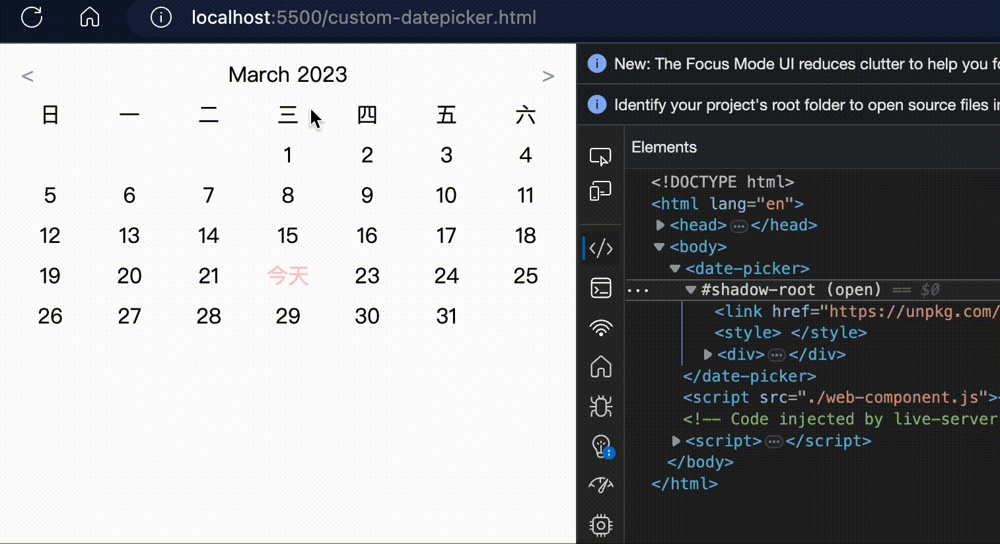

## Web component

[👉 Demo](https://naikyding.github.io/demo/web-component/)

## 說明
使用 customElement 自定義一個「日期選擇器」的 `web component`，demo 只是初步的應用。

**核心技術**
- custom element 自定義元素
- shadowDOM 隱藏 DOM
- template 模版

## 功能
- 上、下切換月份
- 依月份跳年份

## Reference
- [筆記](https://docs-99.vercel.app/Javascript/web-component.html)
